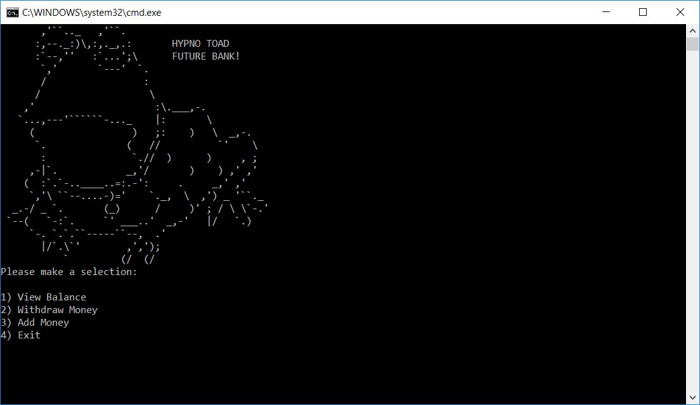
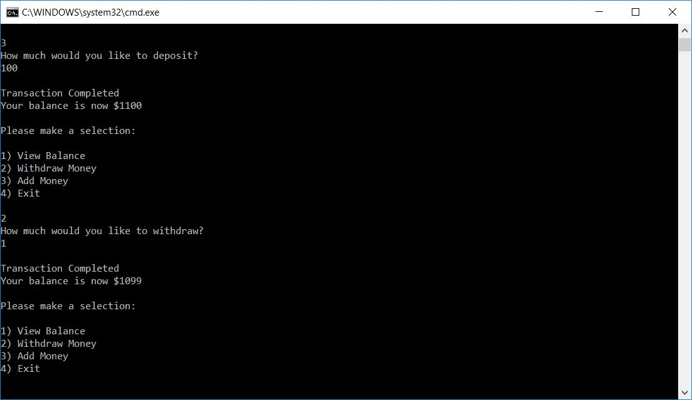
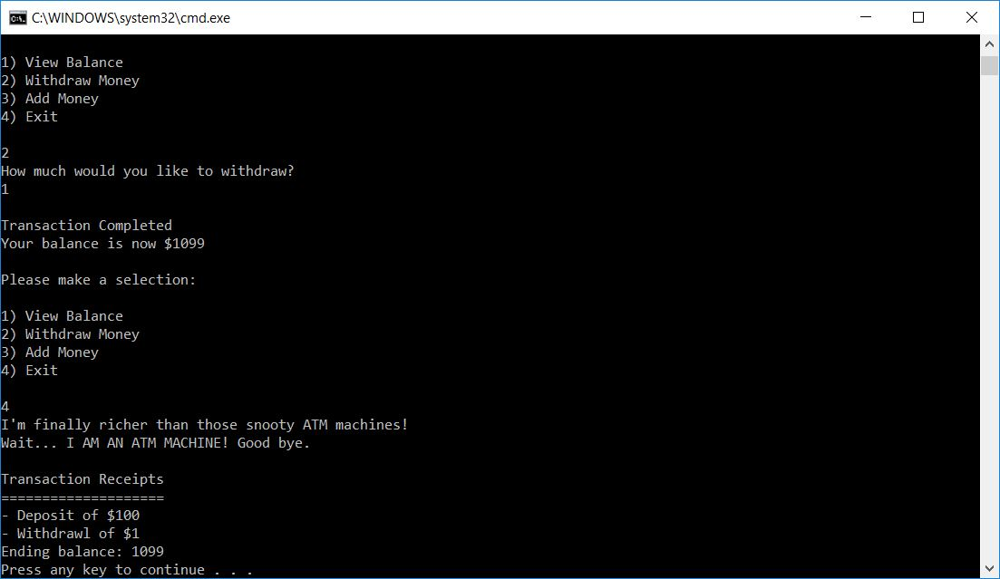

Lab 02: Unit Testing
=====================================

## Purpose
Create a interactive console bank ATM application with unit testing.

## Requirements
- User interface that prompts the user for the valid operations.
- Valid operations: View Balance, Withdraw Money, Add Money.
- Exception handling with try, catch, finally, and throw.
- User can't go below a zero balance.
- Cannot unit test console writeline/readline.
- Methods should just return value and not read input from the console.
- At least 2 unit tests for every non-void method.

### Stretch goal
- Record each transaction the user records and when they exit, provide a receipt for every transaction they conducted.

## Input
- Select your desired operation
- If required, input a valid number (allows decimals).

### Output

 